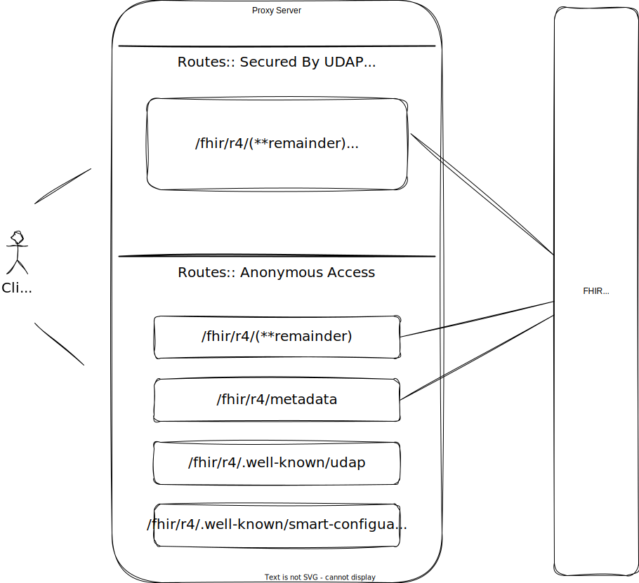

# TEFCA UDAP Proxy Server

Build on dotnet [YARP](https://microsoft.github.io/reverse-proxy/) (Yet Another Reverse Proxy) and ASP.NET Core 8.0

The proxy server is the source of a UDAP metadata endpoint and a SMART on FHIR metadata endpoint.
The [Udap.Metadata.Server](https://www.nuget.org/packages/Udap.Metadata.Server) and [Udap.Smart.Metadata](https://www.nuget.org/packages/Udap.Smart.Metadata) 
packages are used to generate the metadata for the UDAP and SMART on FHIR endpoints, along with appsettings.

YARP Routes and clusters are all configured in appsettings in this example.

## Important concepts.

The proxy has anonymous routes and UDAP secured routes.  To access the FHIR resources, the client must follow UDAP Dynamic Client Registration and obtain an access token.  

All other routes are anonymous.  :spiral_notepad: Note: You will see a SMART endpoints.  This is in anticipation of a future Udap.Auth.Server that also can facilitate SMART on FHIR clients.

Two interesting functiolities are implemented in this proxy server you may want to look at right away.

 #### 1.  **Bearer Token** - In this Proxy scenario your FHIR server will be secured by some mechanism.  Most likely a standard Bearer Access token.  The code implements a GCP ADC technique base on a GCP Service account.  There is also a simple AccessToken technique.  In the appsettings you can set ReverseProxy:Routes:Metadata:AccessToken value to the name of an environment variable that supplies your access token.  Or write your own.
 #### 2.  **Transforms**   - The URLs in the FHIR resources must be transformed.  Specifically for things like paging.  I have not put much time into this so I expect this will not be good enough.
 

You will of course need to configure for your FHIR server.  This example does not include an accessible FHIR Server.  Although it is the FHIR server used by fhirlabs.net and includes all the bits to deploy to a GCP Cloud Run application.

